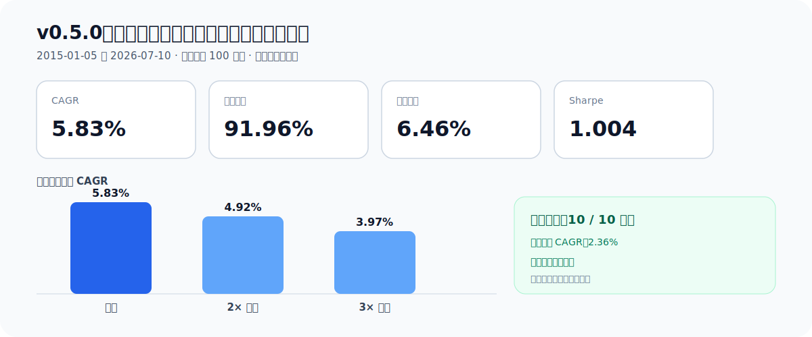
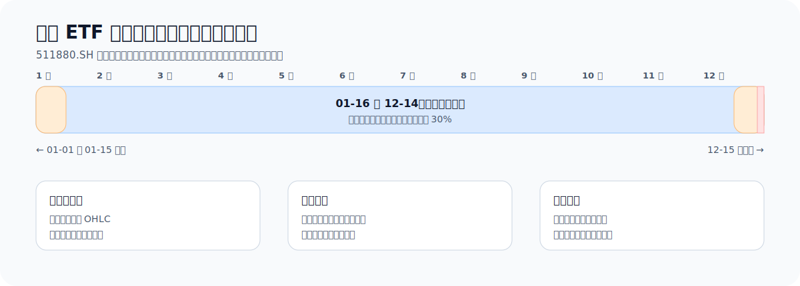
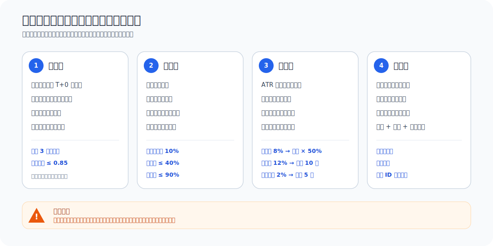

# QMT ETF 自适应轮动

> 用趋势与多周期动量选择强势 ETF，用四周错峰组合降低择时偶然性，用波动率预算和多层安全锁控制风险。

[](https://github.com/guoyaohua/etf-adaptive-rotation-qmt/actions/workflows/ci.yml)
[](https://www.python.org/)
[](https://github.com/guoyaohua/etf-adaptive-rotation-qmt)
[](LICENSE)

当前策略版本：`v0.5.1`

[快速开始](docs/QUICKSTART.md) · [策略详解](docs/STRATEGY.md) · [验证规范](docs/VALIDATION.md) · [版本记录](docs/STRATEGY_UPDATES.md) · [Pages 评估](docs/PAGES.md)

这是一个面向 QMT/xtquant 的日线级 ETF 轮动系统。它会在跨境股票、黄金和国债 ETF 中选择趋势更强、风险调整后表现更好的资产，并用货币 ETF 管理部分闲置资金。项目同时提供无未来函数回测、稳健性验证、模拟信号、账户绑定账本和默认关闭的受保护实盘入口。

> [!IMPORTANT]
> “T+0 ETF”描述的是标的交易资格，不代表策略进行日内高频交易。策略通常每周更新一次目标，单份子组合约持有四周。历史回测不保证未来盈利，真实下单默认关闭。

## 它解决什么问题

| 常见问题 | 本项目的处理 |
|---|---|
| 一次调仓日决定结果 | 四个周度子组合错峰更新，分散日期风险 |
| “跌得少”也被迫买入 | 长期趋势、EMA 斜率和正动量三重过滤 |
| 高波动资产占仓过重 | 风险调整排名、逆波动率权重和 10% 波动率预算 |
| 回测偷看未来 | 收盘生成信号，最早下一交易日开盘执行 |
| 低波资产被噪声洗出 | ATR 止损带 1.5% 最小距离 |
| 现金长期闲置 | 黑窗外最多 30% 配置货币 ETF，且不参加主排名 |
| 实盘重复下单或误卖 | 账户绑定账本、成交去重、计划幂等和人工确认 |
| 行情缺口被当成休市 | QMT 行情与 `XSHG` 交易日历逐日核对 |

## 经审计的研究快照

数据区间为 `2015-01-05` 至 `2026-07-10`，初始权益 100 万元。以下是纯量化 v0.5.0 基线；v0.5.1 只改善文档和图示，不改变交易决策。

| 指标 | 基础成本 | 2× 成本 | 3× 成本 |
|---|---:|---:|---:|
| CAGR | **5.83%** | 4.92% | 3.97% |
| 累计收益 | **91.96%** | 73.77% | 56.56% |
| 最大回撤 | 6.46% | 6.65% | 6.83% |
| Sharpe | 1.004 | 0.854 | 0.695 |
| Calmar | 0.902 | 0.740 | 0.581 |

- 10/10 个滚动三年窗口为正收益，最差 CAGR 为 2.36%；
- 前缀不变性通过，说明未来数据没有改写历史结果；
- `2798/2798` 个 `XSHG` 会话逐日一致；
- 结果已计佣金与滑点，但没有覆盖未来制度、极端折溢价和真实盘口冲击。



> [!WARNING]
> 历史区间已经参与策略研究，且现存 ETF 列表存在幸存者偏差。上述结果只支持继续向前模拟，不是收益承诺。

## 30 秒看懂策略


1. **读取已完成日线**：只使用决策日收盘及以前的数据。
2. **过滤弱势资产**：检查流动性、长期趋势、EMA 斜率和正动量。
3. **比较谁更强**：组合跳过最近 5 日的 20/60/120 日动量，再做风险调整排名。
4. **控制集中风险**：同一风险组最多一只，并过滤过高相关性。
5. **决定买多少**：逆波动率分配，缩放到 10% 目标波动率，单资产不超过 40%，总仓位不超过 90%。
6. **聚合四份信号**：每周更新一份，完整组合是最近四份信号的平均。
7. **通过风险闸门**：ATR 止损、组合回撤、单日亏损和账户安全锁均可阻止或缩减订单。
8. **下一交易日执行**：先卖后买，小于 1% 的现有持仓微调可忽略。

核心动量与排名公式：

$$
M_i = 0.20R_{20,i}^{(-5)} + 0.30R_{60,i}^{(-5)} + 0.50R_{120,i}^{(-5)}
$$

$$
Score_i = \frac{M_i}{\max(\sigma_{40,i}, 0.10)^{0.75}}
$$

权重从逆波动率开始：

$$
w_i = \frac{1 / \sigma_i}{\sum_j (1 / \sigma_j)}
$$

完整推导、筛选边界和参数说明见 [策略详解](docs/STRATEGY.md)。

## 为什么是“四周错峰”

完整资金被视为 A/B/C/D 四份，每份占 25%。每周最后一个 `XSHG` 交易日只产生一份新信号，替换约四周前的旧信号。


这不是“每四周一次性换仓”，也不是“每周把全仓推倒重来”。它让单个调仓日的偶然行情只影响四分之一组合。

## 闲置资金如何处理

当主资产没有用完风险预算时，`511880.SH` 可承接最多 30% 的组合资金，但它：

- 不参与主资产排名；
- 必须保持长期趋势和正动量；
- 每年 `12-15` 至次年 `01-15` 强制空仓；
- 回测不虚构现金分红，只用因果连续序列修复信号；
- 黑窗外出现异常价格复位时安全失败。



## 风险控制不是一条止损线



| 层级 | 默认规则 | 作用 |
|---|---|---|
| 单资产 | 初始止损：入场价 − max(2.5 × ATR, 1.5%) | 限制单标的损失 |
| 盈利保护 | 浮盈 1.5 × ATR 后启用 3 × ATR 跟踪止损 | 控制盈利回吐 |
| 组合软回撤 | 回撤 8% 时，后续目标缩至 50% | 主动降风险 |
| 组合硬回撤 | 回撤 12% 时清仓并冷却 10 日 | 阻断失控阶段 |
| 单日亏损 | 亏损 2% 时清仓并冷却 5 日 | 防止异常日扩散 |
| 实盘安全 | 账户绑定、混仓拒绝、计划幂等、人工确认 | 防误卖与重复下单 |

`live-monitor` 是前台保护程序，不是券商端止损或 Windows 服务。窗口关闭、休眠、QMT 或网络断开都会停止保护。

## 三步开始 dry-run

环境要求：Windows、Python 3.10+、已启动并可使用 `xtquant` 的 QMT。

### 1. 安装

```powershell
git clone https://github.com/guoyaohua/etf-adaptive-rotation-qmt.git
Set-Location etf-adaptive-rotation-qmt
.\scripts\install.ps1
```

### 2. 本地配置

```powershell
Copy-Item configs\local.example.yaml configs\local.yaml
$env:QMT_CLIENT_PATH = '<QMT userdata_mini 路径>'
$env:QMT_ACCOUNT_ID = '<资金账号>'
```

首次使用保持 `qmt.allow_live_orders: false`。账号、路径、Token 和密码不得写入 YAML。

### 3. 初始化并观察

```powershell
.\scripts\setup.ps1 -Capital 100000 -Connect
.\scripts\live.ps1
```

默认只生成计划，不提交订单。完整安装、回测、模拟盘和实盘步骤见 [快速开始](docs/QUICKSTART.md)。

## 文档导航

| 想了解什么 | 文档 |
|---|---|
| 安装、初始化、dry-run、实盘开关 | [快速开始](docs/QUICKSTART.md) |
| 策略公式、调度与边界条件 | [策略详解](docs/STRATEGY.md) |
| 回测口径、成本压力与上线门槛 | [验证规范](docs/VALIDATION.md) |
| 命令、输入与本地产物 | [运行手册](docs/OPERATIONS.md) |
| 可选 LLM 风险复核 | [LLM 说明](docs/LLM.md) |
| 账户、Token 与提交安全 | [安全规范](docs/SECURITY.md) |
| 每个版本改了什么 | [追加式版本记录](docs/STRATEGY_UPDATES.md) |
| 是否建设 GitHub Pages | [Pages 建设评估](docs/PAGES.md) |

## 项目边界

- 不预测下一日涨跌，不使用杠杆、融资或卖空；
- 不因为标的是 T+0 就进行日内反复交易；
- 不处理实时 IOPV、申赎额度和海外休市错位；
- 日线 OHLC 无法还原盘中路径、极端跳空和真实盘口冲击；
- QMT 没有可可靠对账的策略级分红流水，因此货币 ETF 在年末黑窗强制空仓；
- 部分成交、撤单、进程中断和券商差异仍须在模拟盘逐项验证；
- 可选 LLM 只能减仓，且必须单独做时间封存的向前验证。

## 本地验证

```powershell
python -m pytest
python -m compileall -q src tests scripts
python scripts/security_check.py
.\scripts\validate.ps1 -Start 20150101 -End 20260710
```

`data/qmt/`、`reports/`、`runtime/` 和本地配置均不进入 Git。

## 免责声明

本项目仅用于量化研究和软件工程示例，不构成投资建议、收益承诺或代客理财服务。使用者应独立核实交易规则、费用、税务与风险，并自行承担交易损失。
