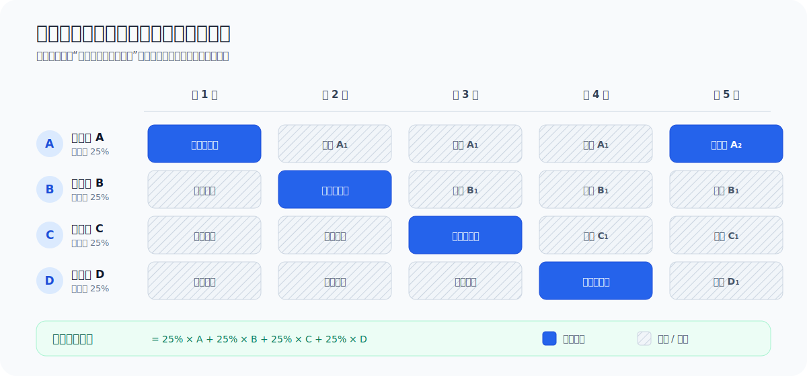
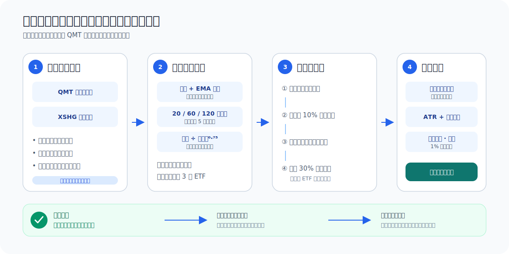

# ETF Adaptive Rotation for QMT

[](https://github.com/guoyaohua/etf-adaptive-rotation-qmt/actions/workflows/ci.yml)
[](https://www.python.org/)
[](LICENSE)

当前策略版本：`v0.4.0`。每次完整更新的追加式记录见 [策略更新日志](docs/STRATEGY_UPDATES.md)。
可用 `etf-rr --version` 查询当前代码版本。

面向 QMT 的 T+0 ETF 自适应轮动项目：用已完成的日线做趋势与相对强弱判断，在跨境股票、黄金和国债 ETF 之间配置，并通过四个错峰子组合、波动率预算、现金储备和组合熔断控制回撤。研究、回测、信号和 QMT 订单计划共用同一套策略逻辑。

> [!IMPORTANT]
> 项目不承诺稳定盈利、固定收益率或最大回撤。历史回测不能覆盖未来制度、流动性、折溢价和跳空风险；首次使用必须先回测和模拟盘，真实下单默认关闭。

## 先回答：多久调一次仓？

**完整组合每周滚动调仓一次，单个子组合约持有四周。**

- 每周最后一个交易日收盘后生成一份新信号；常规周是周五，周五休市时使用交易所日历确认的更早会话；
- 组合分成 A/B/C/D 四个等权子组合，每周只替换其中一个；
- 新目标最早在下一交易日执行，不使用决策日收盘后才知道的信息在当天成交；
- `XSHG` 交易所日历与 QMT 行情日期必须逐日一致；数据缺口不会被误判成休市，日历不覆盖未来日期时也会拒绝运行并要求升级依赖。

因此它既不是“每四周全仓换一次”，也不是“每周把全仓全部重算”。稳定运行后，每周约有四分之一的信号来源到期并被替换，单份信号的设计持有期是四周；实际订单还受目标权重变化、整手和 1% 免交易带影响，所以某周也可能没有订单。



## 策略如何工作



每个周度信号依次经过以下步骤：

1. **资格过滤**：只接受配置中明确标记为 T+0 的 ETF，并检查历史长度、价格、成交额和 OHLC 数据质量。
2. **绝对趋势**：股票 ETF 要站上 180 日均线，黄金和国债 ETF 要站上 100 日均线；所有候选的 50 日 EMA 在过去 20 日还需向上。
3. **多周期动量**：跳过最近 5 个交易日，组合 20/60/120 日收益，权重分别为 20%/30%/50%。
4. **风险调整排名**：用 40 日年化波动率的 $0.75$ 次幂惩罚高波动资产，避免与后续逆波动率仓位重复全额惩罚，分数必须为正。
5. **去除重复暴露**：每份信号最多 3 只 ETF；同一风险组最多一只，与已选资产的 60 日相关系数不得高于 0.85。
6. **仓位计算**：先做逆波动率分配，再缩放至 10% 组合目标波动率；若仍有闲置预算且国债 ETF 保持长期上升趋势和正动量，可配置最多 30% 的国债现金代理；单资产不高于 40%，总风险仓位不高于 90%，不使用杠杆。
7. **四份信号聚合**：最近四个有效周度决策日的目标各占完整组合的 25%，不足四份的部分保留现金。
8. **订单差额**：按策略资金上限和实时价格换算整手数量，先评估实时风险、再卖后买；现有持仓的小幅调权不足策略资金的 1% 时不交易，但完整退出和新建仓不受免交易带限制。

核心公式为：

```math
M_i = 0.20 R_{20,i}^{(-5)} + 0.30 R_{60,i}^{(-5)} + 0.50 R_{120,i}^{(-5)}
```

```math
Score_i = \frac{M_i}{\max(\sigma_{40,i}, 0.10)^{0.75}}
```

```math
w_i = \frac{1 / \sigma_i}{\sum_j (1 / \sigma_j)}
```

这里 $R_{n,i}^{(-5)}$ 是跳过最近 5 日后的 $n$ 日收益，$\sigma_{40,i}$ 是 40 日年化波动率。$0.75$ 次幂是在 0.70–0.80 邻域验证后采用的中间值；完整公式、边界条件、调度示例和输出字段解释见 [策略完整说明](docs/STRATEGY.md)。

### `risk_on` / `risk_off` 是什么？

程序根据股票候选的趋势广度和动量中位数生成市场状态标签。默认 `allocation_mode: unified` 下，它主要用于诊断：股票、黄金和国债仍在同一个候选池竞争；`risk_off` **不会**自动强制只买防守资产。

### 什么情况下会持有现金？

- 没有 ETF 同时通过趋势、正动量和流动性过滤；
- 可选资产较少，40% 单资产上限留下余额；
- 组合估算波动率高于 10%，触发同比缩仓；
- 国债 ETF 不满足长期趋势和正动量，闲置预算不启用现金代理；
- 90% 总仓位上限保留至少 10% 现金；
- 四个子组合尚未初始化完成；
- 组合处于风险冷却期。

现金是策略的一部分，不代表程序漏选。

## 风险控制

| 层级 | 默认值 | 含义 |
|---|---:|---|
| 初始止损 | 入场价 − max(2.5 × ATR(20), 1.5% × 入场价) | 限制风险并避免低波资产被微小噪声洗出 |
| 跟踪激活 | 浮盈达到 1.5 × 入场 ATR | 避免过早收紧 |
| 跟踪止损 | 最高价 − max(3.0 × 入场 ATR, 1.5% × 入场价) | 控制盈利回吐 |
| 组合软回撤 | 8% | 下一次目标风险仓位缩放至 50% |
| 组合硬回撤 | 12% | 清仓，冷却 10 个交易日 |
| 单日亏损 | 2% | 清仓，冷却 5 个交易日 |

日线回测使用保守的 OHLC 止损模型。实盘由两个独立入口组成：`live.ps1` 负责单次周度轮动计划，`live-monitor.ps1` 在连续交易时段轮询实时价格并执行 ATR、组合硬回撤和单日亏损退出。监控程序包含账户/账本一致性、幂等风险计划和在途单安全锁，但仍必须先通过长时间模拟盘验证，不能把历史回测当成无人值守可靠性的证明。

## 可选 LLM 周度复核

LLM 位于量化目标之后、订单计划之前。它不是另一个选股器，只能对量化目标执行 `KEEP`（保持）、`REDUCE`（缩仓）或 `EXIT`（退出）：不能新增标的、不能提高任何权重，也不能突破既有仓位、ATR 止损或组合熔断。默认关闭，因此历史回测仍完全可复现。

安装 LiteLLM 支持：

```powershell
.\scripts\install.ps1 -WithLlm
```

在 `configs/local.yaml` 中开启默认的单模型 Copilot：

```yaml
llm:
  enabled: true
  mode: single
  models: ["github_copilot/gemini-3-pro-preview"]
```

Token 只通过当前 PowerShell 的环境变量传入。使用 GitHub Copilot provider 前，需要确认 Token 的来源、权限与用法符合 GitHub/Copilot 当前服务条款；不要把个人订阅凭据共享给他人或部署到公共服务器：

```powershell
$env:GITHUB_TOKEN = '<GitHub Token>'
.\scripts\llm-signal.ps1
```

`llm-signal.ps1` 和 LLM dry-run 都会产生真实模型调用费用或订阅额度消耗，但不会提交交易委托。

多模型投票示例：

```yaml
llm:
  enabled: true
  mode: vote
  models:
    - github_copilot/gemini-3-pro-preview
    - github_copilot/claude-sonnet-4.5
    - github_copilot/gpt-5.2
  min_valid_votes: 2
  consensus_ratio: 0.50
  failure_policy: quant_only
```

只有严格过半的有效票会生效；低于 `min_confidence` 的风险动作降级为 `KEEP`。模型全部失败、合法票不足或没有明确多数时，默认 `quant_only` 回退原量化目标。还可选择更保守的 `all_cash`，或使用 `error` 中止计划。

每周决策缓存在 `runtime/llm/`，同一目标、模型和投票参数重复运行会复用结果。只有明确使用 `-Refresh` 或 `--refresh-llm` 才重新调用模型。缓存包含完整投票和模型原始响应，但不包含 Token，并且不会提交 Git。LLM 输出具有非确定性，启用后不能把当前纯量化历史回测指标视为 LLM 版本的回测结果。

## 五分钟开始

### 1. 一键安装

环境要求：Windows、Python 3.10+、已启动并可使用 `xtquant` 的 QMT 客户端。

```powershell
git clone https://github.com/guoyaohua/etf-adaptive-rotation-qmt.git
Set-Location etf-adaptive-rotation-qmt
.\scripts\install.ps1
```

脚本会安装项目、开发依赖，运行敏感信息扫描和测试。若系统禁止本地 PowerShell 脚本，可只对当前进程临时放行：

```powershell
Set-ExecutionPolicy -Scope Process Bypass
.\scripts\install.ps1
```

### 2. 准备本地配置和环境变量

```powershell
Copy-Item configs\local.example.yaml configs\local.yaml
$env:QMT_CLIENT_PATH = '<QMT userdata_mini 路径>'
$env:QMT_ACCOUNT_ID = '<资金账号>'
```

`configs/local.yaml` 通过 `extends: strategy.yaml` 继承默认参数，只需保留本机覆盖项。它和 `.env`、行情、报告、运行账本都不得提交 Git。账号、密码、Key、Token 和真实 QMT 路径不要写入 YAML 或脚本；本项目只从 `QMT_CLIENT_PATH`、`QMT_ACCOUNT_ID` 以及可选的 `GITHUB_TOKEN` 环境变量读取敏感信息。环境变量默认只在当前 PowerShell 会话有效。

第一次使用时保持本地配置中的：

```yaml
qmt:
  allow_live_orders: false
```

### 3. 一键初始化

```powershell
.\scripts\setup.ps1 -Capital 100000 -Connect
```

`Capital` 是此策略可使用的资金上限，不是单笔买入金额，也不应超过账户总资产。实际调仓基数取“该上限”和策略账本按实时价格计算的权益两者较小值，不会在亏损后自动借用账户其他现金补回初始规模。初始化会创建与当前账户指纹和 `strategy_tag` 绑定的本地账本（已存在则原样保留）、下载日线并执行环境体检。连续交易时段会生成第一份联网 dry-run 计划；休市时改为生成离线信号，不会因实时报价过期而失败。

如在休市时初始化，可先完成前置步骤，再在交易时段运行下一节的 dry-run。**不要为了重建账本随意删除或覆盖 `runtime/state.json`**；账本丢失会失去策略持仓归属和成交去重信息。

### 4. 一键 dry-run（推荐先连续观察）

在连续交易时段运行：

```powershell
.\scripts\live.ps1
```

它会刷新已完成日线、校验交易所日历、聚合最近四份周度信号、按本地配置执行可选 LLM 复核、对账成交、检查账户与策略持仓是否混用，并把计划写入 `runtime/latest_order_plan.json`。默认只展示计划，**不会下单**。

若只想离线查看目标权重，不需要连接交易账户：

```powershell
etf-rr signal --config configs/local.yaml --output runtime/latest_signal.json
```

### 5. 一键受保护实盘

完成回测和至少 20 个交易日模拟盘后，才考虑把 `configs/local.yaml` 中的 `qmt.allow_live_orders` 改为 `true`，然后在连续交易时段执行：

```powershell
.\scripts\live.ps1 -Execute
```

命令仍会要求人工输入精确确认短语 `LIVE_ETF_RR`。这是刻意保留的最后一道人工确认，不应写进脚本自动输入。轮动委托成交后运行：

```powershell
.\scripts\reconcile.ps1
```

若希望程序在盘中持续执行保护性退出，另开一个 PowerShell 窗口并运行：

```powershell
.\scripts\live-monitor.ps1 -Execute
```

启动时同样需要输入 `LIVE_ETF_RR`。程序每 5 秒检查一次，午休保持等待，收盘后自动结束；可按 `Ctrl+C` 安全停止。只演练风控判断、不提交订单时去掉 `-Execute`；只检查一次可加 `-Once`。监控不是 Windows 服务，窗口关闭、电脑休眠、QMT 断开或网络故障都会停止保护，因此实盘时仍需设置券商端风控并人工看护。

`live-monitor` 持有策略运行锁，运行时会拒绝 `live.ps1` 和独立对账并发修改账本。需要执行周度调仓时，先用 `Ctrl+C` 正常停止监控，运行 `live.ps1`（成交后对账），再重新启动监控。

实盘只有同时满足以下条件才允许提交：

1. 本地配置显式开启 `qmt.allow_live_orders: true`；
2. 命令显式加入 `-Execute`；
3. 人工输入 `LIVE_ETF_RR`；
4. 账户绑定账本存在，且 `strategy_tag` 一致；
5. 同代码没有人工或其他策略持仓；
6. 策略资金上限大于 0 且不超过账户总资产；
7. 报价足够新，代码没有任何在途委托；
8. 相同计划没有提交过；
9. 没有错过信号后的首个执行日；追单必须显式使用 `-AllowLate`，且应重新人工评估。

任何一项失败都会拒绝下单。首次实盘建议降低资金上限并逐笔核对 QMT 委托、成交和本地账本。

> [!CAUTION]
> 实盘前请确认账户内没有本策略代码的既有人工/其他策略持仓。新账本从零持仓开始，不会自动接管旧仓；如果首次对账遇到“卖出超过策略账本持仓”，应立即停止并核对 `strategy_tag` 和历史成交，不能手工篡改账本来绕过检查。

## 常用工作流

### 下载历史行情

```powershell
etf-rr download --config configs/local.yaml --start 20150101 --end 20260710
```

若 `--end` 是当前盘中或未来日期，下载器会自动截断到最后已完成日历日，并在 `metadata.json` 中记录 `completed_through`。离线信号只使用这个已确认边界，避免把盘中日线或陈旧缓存当成完整收盘数据。

### 回测与双倍成本压力测试

```powershell
etf-rr backtest `
  --config configs/local.yaml `
  --start 20150101 `
  --end 20260710 `
  --output reports/latest
```

命令生成 `REPORT.md`、`summary.json`、权益曲线、成交和目标记录；研究门槛未全部通过时返回非零退出码。

等价的一键脚本为：

```powershell
.\scripts\backtest.ps1 -Start 20150101 -End 20260710
```

### 完整稳健性验证

```powershell
.\scripts\validate.ps1 -Start 20150101 -End 20260710 -Output reports\validation-latest
```

该命令额外执行 1×/2×/3× 成本压力、36 个月滚动窗口、前缀不变性和交易所日历逐日一致性检查，并把策略版本及代码、配置、行情 SHA-256 指纹写入报告。它用于冻结版本后的复核，不能把已参与研究的历史区间变成未触碰样本。

### 环境体检

```powershell
etf-rr doctor --config configs/local.yaml --connect
```

也可以运行 `.\scripts\doctor.ps1 -Connect`。

### 成交对账

```powershell
etf-rr reconcile --config configs/local.yaml
```

对账根据 QMT 的 `strategy_tag` 查询成交，并用成交 ID 幂等更新 `runtime/state.json`；重复运行不会重复记账。账本创建前的历史成交会被时间基线排除，但每个账户/策略仍应使用唯一的 `execution.strategy_tag`，以便人工排查和避免归属歧义。

## 命令、输入和产物

| 入口 | 需要 QMT | 会下单 | 主要产物 |
|---|---:|---:|---|
| `scripts/install.ps1` | 否 | 否 | 本地 Python 安装、测试结果 |
| `scripts/setup.ps1` | 是 | 否 | `runtime/state.json`、日线、首份计划 |
| `etf-rr signal` | 只需已缓存日线 | 否 | `runtime/latest_signal.json` |
| `etf-rr backtest` | 只需已缓存日线 | 否 | `reports/<name>/` |
| `scripts/live.ps1` | 是 | 否 | `runtime/latest_order_plan.json` |
| `scripts/live.ps1 -Execute` | 是 | 是，需三重确认 | QMT 委托 + 本地计划状态 |
| `scripts/live-monitor.ps1` | 是 | 否 | 实时风险判断日志 |
| `scripts/live-monitor.ps1 -Execute` | 是 | 是，需配置锁和人工确认 | 风险退出委托 + 账本状态 |
| `scripts/reconcile.ps1` | 是 | 否 | 更新后的 `runtime/state.json` |
| `scripts/llm-signal.ps1` | 行情缓存 + LLM | 否 | `runtime/latest_llm_signal.json`、LLM 审计缓存 |

`runtime/`、`data/qmt/` 和 `reports/` 都是本机运行产物，不进入 Git。

## 当前研究结果

本机 QMT 前复权日线区间为 2015-01-05 至 2026-07-10，初始权益 100 万元：

行情加载器会校正 QMT 复权序列中仍遗漏、且价格与份额呈明确整数反向变化的 ETF 份额拆分；当前样本识别到纳指 ETF 的 5:1 和标普 500 ETF 的 2:1。

| 指标 | 基础成本 | 双倍成本 |
|---|---:|---:|
| CAGR | 5.56% | 4.72% |
| 累计收益 | 86.48% | 70.02% |
| 最大回撤 | 6.44% | 6.57% |
| 年化波动率 | 6.02% | 6.03% |
| Sharpe | 0.963 | 0.823 |
| Calmar | 0.864 | 0.718 |
| 正收益年份比例 | 83.33% | 83.33% |

> [!WARNING]
> 候选结构曾参考这些历史区间，因此它们不是严格的未触碰测试集；现存 ETF 列表还存在幸存者偏差。结果只支持进入向前模拟盘，不证明未来能稳定盈利。详细分段、门槛与上线流程见 [验证规范](docs/VALIDATION.md)。

## 项目结构

```text
configs/strategy.yaml          可提交的默认策略配置
configs/local.example.yaml     本地配置模板；复制品不得提交
docs/STRATEGY.md               策略公式、调仓时序和边界条件
docs/STRATEGY_UPDATES.md       只追加、不覆盖的策略版本更新记录
docs/SECURITY.md               敏感信息与提交规范
src/etf_rotation/strategy.py   信号、筛选、仓位与子组合聚合
src/etf_rotation/backtest.py   无未来函数的组合回测器
src/etf_rotation/risk.py       回测风险状态机
src/etf_rotation/runtime.py    实盘账本、成交幂等和计划状态
src/etf_rotation/llm_decision.py  LiteLLM 调用、结构化校验和多模型投票
src/etf_rotation/qmt.py        QMT 查询、计划和下单安全锁
src/etf_rotation/cli.py        命令行入口
scripts/                       一键安装、初始化、运行、对账和安全扫描
tests/                         单元与回归测试
data/qmt/                      本地行情缓存，不进入 Git
reports/                       本地回测报告，不进入 Git
runtime/                       账户账本和订单计划，不进入 Git
```

## 测试与安全扫描

```powershell
python -m pytest
python -m compileall -q src tests scripts
python scripts/security_check.py
git status --short
```

GitHub Actions 会重复执行自动检查。扫描器只报告疑似秘密所在文件和行号，不打印匹配内容；提交前仍需人工审查 `git diff --cached`。完整规范见 [安全说明](docs/SECURITY.md)。

## 已知限制

- 使用现存 ETF 回看历史，仍可能有幸存者偏差；
- 日线 OHLC 无法还原盘口冲击、日内路径和极端跳空；
- 当前没有实时 IOPV、折溢价、申赎额度和海外休市错位过滤；
- `live-once` 是单次轮动计划；保护性退出依赖另行启动的 `live-monitor`，它不是后台系统服务；
- 部分成交、撤单、进程/网络中断恢复和券商差异仍必须在模拟盘逐项验证；
- 参数应冻结后向前观察，不能为了提高同一历史样本收益继续反复拟合。
- LLM 版本需要单独进行时间封存的向前验证；供应商模型升级也可能改变同一提示词的输出。

参考策略的问题与本项目对应改造见 [参考策略审查](docs/REFERENCE_AUDIT.md)。

## 免责声明

本项目仅用于量化研究和软件工程示例，不构成投资建议、收益承诺或代客理财服务。使用者应独立核实交易规则、费用、税务与风险，并自行承担交易损失。
