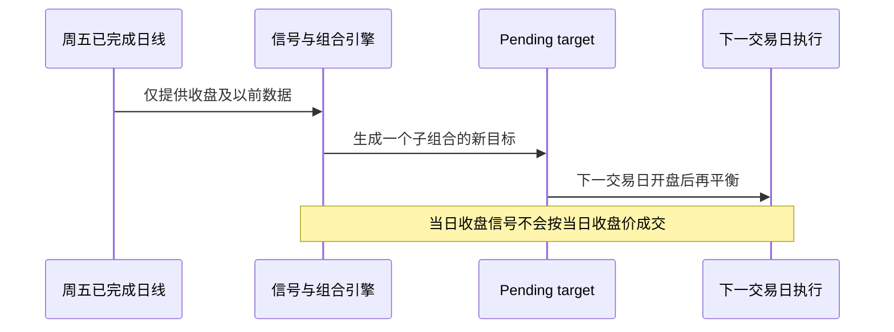

# ETF Adaptive Rotation for QMT

[](https://github.com/guoyaohua/etf-adaptive-rotation-qmt/actions/workflows/ci.yml)
[](https://www.python.org/)
[](LICENSE)

一个面向 QMT 的 T+0 ETF 自适应轮动研究与订单计划项目。策略在跨境股票、黄金和国债 ETF 之间做绝对趋势过滤与相对强弱配置，通过四个错峰四周子组合、波动率目标和独立组合风控降低单一调仓日与高波动资产带来的回撤。

> [!IMPORTANT]
> 项目不承诺稳定盈利或固定收益率。历史回测受到幸存者偏差、复权、折溢价、成交冲击和制度变化影响；默认禁止真实下单。


## 为什么重新设计

参考策略以 tick 级追涨或均线穿越为主，存在信号噪声大、缺少组合风险预算、异步订单状态不足，以及单日同样本调参等问题。本项目保留 QMT 数据与交易接口思路，但将研究、信号、组合、风险、成交和券商适配器彻底分层。详细审查见 [REFERENCE_AUDIT.md](docs/REFERENCE_AUDIT.md)。

核心目标按优先级排列：

1. 控制最大回撤和单次风险暴露；
2. 提高跨市场状态的风险调整后收益；
3. 降低无效换手和对单个调仓日的依赖；
4. 保证回测信号与 QMT 订单计划使用同一套逻辑。

## 策略逻辑

### 1. 可交易标的与数据资格

默认标的覆盖美国、香港、日本、欧洲等跨境股票 ETF，以及黄金和国债 ETF。候选必须同时满足：

- 在配置中明确列入 T+0 白名单；
- 具有足够的历史窗口；
- 最新价格不低于 `0.50` 元；
- 20 日平均成交额不低于 2,000 万元；
- OHLC 数据有效，可以计算 ATR 和波动率。

T+0 资格最终以券商和交易所当日规则为准。跨境 ETF 还可能受海外休市、额度限制和折溢价影响。

### 2. 绝对趋势过滤

股票型 ETF 需要站上 180 日均线，黄金和国债 ETF 需要站上 100 日均线；所有候选还必须满足 50 日 EMA 的 20 日斜率为正。这个过滤器的作用是允许策略长期持有现金，而不是在所有资产都走弱时强制选出“相对最不差”的标的。

### 3. 风险调整动量排名

动量信号跳过最近 5 个交易日，减少短期脉冲追涨：

$$
M_i = 0.20R_{20,i}^{(-5)} + 0.30R_{60,i}^{(-5)} + 0.50R_{120,i}^{(-5)}
$$

风险调整后的横截面分数为：

$$
Score_i = rac{M_i}{max(sigma_{40,i}, 10%)}
$$

其中 $R_{n,i}^{(-5)}$ 是跳过最近 5 日后的 $n$ 日收益，$sigma_{40,i}$ 是 40 日年化波动率。分数必须为正。

### 4. 分组与相关性约束

每个子组合按分数从高到低选择最多 3 只 ETF，并执行两项约束：

- 同一风险组只保留一只，例如纳指与标普 500 不在同一子组合重复持有；
- 与已选资产 60 日相关系数高于 `0.85` 时跳过。

这避免了代码不同但底层暴露高度相似的“伪分散”。

### 5. 四个错峰四周子组合

组合均分为 A/B/C/D 四个 25% 子组合。每周五收盘只更新其中一个子组合，因此每个子组合的信号持有四周，最终目标是四者平均值。它是固定四周周期，不等同于自然月末调仓。


相比固定“每四周”调仓，错峰结构不依赖回测从哪一周开始；相比全组合周调仓，它保留对新趋势的逐周响应，同时平滑换仓冲击。

### 6. 仓位分配

子组合内先按逆波动率分配：

$$
	ilde{w}_i = rac{1/sigma_i}{sum_j 1/sigma_j}
$$

随后根据 60 日协方差把组合年化波动率缩放到 10% 目标，并应用：

- 单资产权重上限 40%；
- 总风险资产仓位上限 90%；
- 至少 10% 现金储备；
- 目标变化小于账户权益 1% 时不交易。

目标波动率是上限与缩放基准，不是收益目标；市场剧烈跳空时实际波动仍可能超出。

### 7. 风控与退出

| 风控层 | 默认规则 | 作用 |
|---|---:|---|
| 初始止损 | 入场价减 $2.5	imes ATR_{20}$ | 限制单资产初始风险 |
| 跟踪激活 | 浮盈达到 $1.5	imes ATR$ | 避免过早收紧止损 |
| 跟踪止损 | 峰值减 $3.0	imes ATR$ | 让利润奔跑并控制回吐 |
| 组合软回撤 | 8% 后仓位缩放至 50% | 降低风险暴露 |
| 组合硬回撤 | 12% 后清仓并冷却 10 日 | 尾部风险熔断 |
| 单日亏损 | 2% 后清仓并冷却 5 日 | 阻断异常交易日 |

日线回测采用保守的 OHLC 止损模型：若开盘已经越过止损位，按更差的开盘价退出；否则按止损价成交。真实市场的流动性冲击仍可能更差。

## 防止未来函数



测试会修改决策日之后的数据并断言历史信号不变。回测还包含整手约束、佣金、最低佣金、双边滑点和双倍成本压力测试。

## 历史研究结果

数据来自本机 QMT 日线，区间为 2015-01-05 至 2026-07-10，共 11.51 年。初始权益为 100 万元。

| 指标 | 基础成本 | 双倍成本 |
|---|---:|---:|
| CAGR | 4.82% | 3.93% |
| 累计收益 | 71.93% | 55.76% |
| 最大回撤 | 6.82% | 7.05% |
| 年化波动率 | 5.92% | 5.93% |
| Sharpe | 0.854 | 0.703 |
| Sortino | 0.958 | 0.787 |
| Calmar | 0.706 | 0.557 |
| 正收益年份比例 | 83.33% | 83.33% |

> [!WARNING]
> 上述区间参与了候选结构选择，不是未触碰测试集。结果只能说明该设计值得进入模拟盘验证，不能证明未来稳定盈利。完整分段记录与上线门槛见 [VALIDATION.md](docs/VALIDATION.md)。

## 项目结构

```text
configs/strategy.yaml       标的池、策略、风控、成本与 QMT 配置
docs/assets/                README 使用的 SVG 策略图
src/etf_rotation/strategy.py 信号、筛选、仓位和错峰子组合
src/etf_rotation/backtest.py 无未来函数的组合回测器
src/etf_rotation/risk.py     单资产与组合风控状态机
src/etf_rotation/qmt.py      QMT 查询、订单计划与安全锁
src/etf_rotation/cli.py      download / backtest / signal / qmt-plan
scripts/security_check.py    提交前敏感信息扫描
tests/                       单元与回归测试
data/qmt/                    本地行情缓存，不进入 Git
reports/                     本地回测报告，不进入 Git
runtime/                     本地信号、订单和持仓账本，不进入 Git
```

## 快速开始

### 环境要求

- Python 3.10 或更高版本；
- Windows QMT 客户端及可用的 `xtquant` 环境；
- QMT 行情服务启动后才能下载数据；
- 公共依赖只有 NumPy、pandas 和 PyYAML。

### 安装

```powershell
git clone https://github.com/guoyaohua/etf-adaptive-rotation-qmt.git
cd etf-adaptive-rotation-qmt
python -m pip install -e .[dev]
```

### 下载 QMT 日线

```powershell
etf-rr download --config configs/strategy.yaml --start 20150101 --end 20260710
```

行情写入 `data/qmt/`，该目录默认不提交。

### 回测与压力测试

```powershell
etf-rr backtest `
  --config configs/strategy.yaml `
  --start 20150101 `
  --end 20260710 `
  --output reports/latest
```

命令自动运行基础成本和双倍成本两组回测，并生成 `REPORT.md`、`summary.json`、权益、成交和目标记录。研究门槛未全部通过时返回非零退出码。

### 生成最新目标

```powershell
etf-rr signal --config configs/strategy.yaml --output runtime/latest_signal.json
```

`signal` 与回测使用相同调度逻辑，会聚合最近四个已完成周五信号。

## QMT 订单计划与安全边界

账号与客户端路径只从环境变量读取：

```powershell
$env:QMT_CLIENT_PATH = '<本机 QMT userdata_mini 路径>'
$env:QMT_ACCOUNT_ID = '<资金账号>'
etf-rr qmt-plan --config configs/strategy.yaml --capital 100000
```

`--capital` 是策略独立资金上限，不会默认使用整个账户净值。默认命令只查询账户并写出计划，不下单。真实执行需要同时满足：

1. 将本地配置中的 `qmt.allow_live_orders` 设为 `true`；
2. 命令显式加入 `--execute`；
3. 人工输入精确确认短语 `LIVE_ETF_RR`；
4. 同代码不存在人工持仓与策略持仓混用；
5. 没有该代码的在途订单，且行情未过期。

卖出数量还会取策略账本、账户持仓和 QMT 可用数量的交集。当前版本没有自动维护成交账本，因此定位为研究与订单计划工具；完成成交回调、部分成交、撤单和崩溃恢复前，不应打开真实执行开关。

## 测试与安全扫描

```powershell
python -m pytest
python -m compileall -q src tests scripts
python scripts/security_check.py
```

GitHub Actions 会重复执行这些检查。`.env`、本地配置、行情、报告、运行状态、证书和私钥格式均被 `.gitignore` 排除。扫描器只报告文件与行号，不打印疑似秘密。详细规范见 [SECURITY.md](docs/SECURITY.md)。

## 已知限制与下一步

- 当前 ETF 列表是现存标的，历史回测仍可能有幸存者偏差；
- 日线 OHLC 无法还原真实日内路径、盘口冲击和极端跳空；
- 未使用 ETF 实时 IOPV/折溢价过滤，跨境 ETF 异常溢价仍是风险；
- 参数应保持冻结，下一阶段是至少 20 个交易日的向前模拟盘，而不是继续拟合同一历史区间；
- 实盘执行仍需补齐可靠的订单/成交状态机和持仓账本自动恢复。

## 免责声明

本项目仅用于量化研究和软件工程示例，不构成投资建议、收益承诺或代客理财服务。使用者应独立核实交易规则、费用、税务与风险，并自行承担交易损失。
