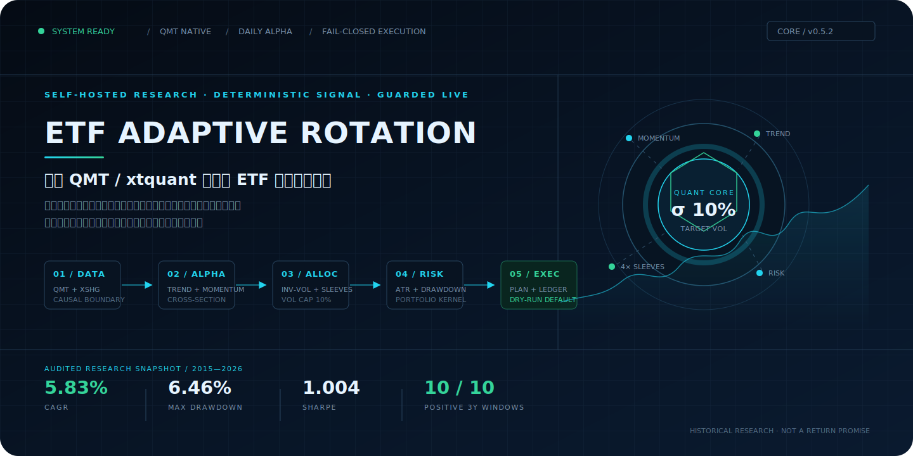
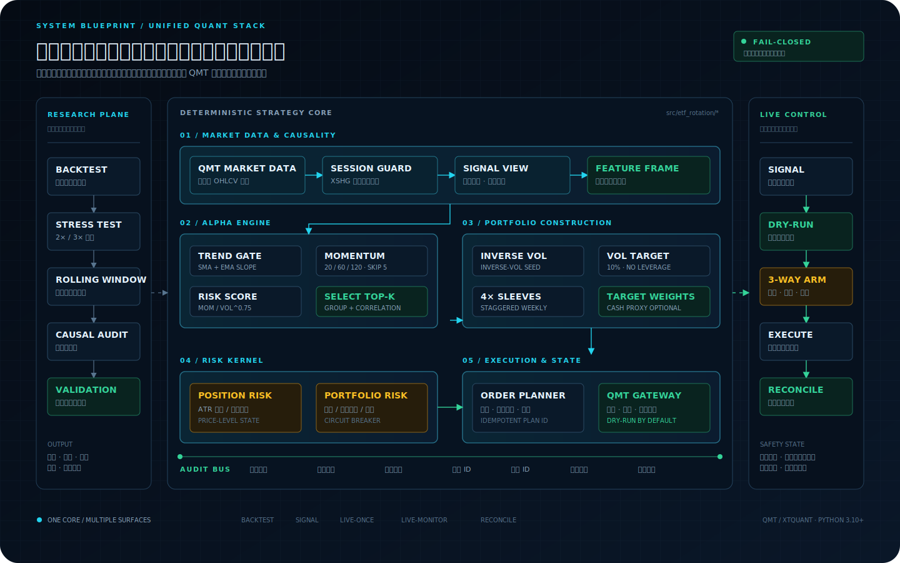
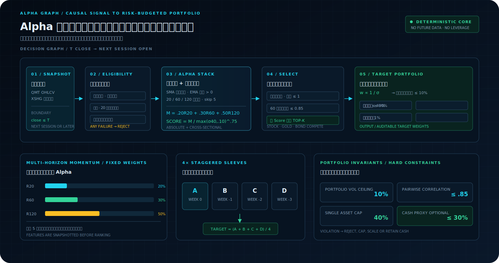

<div align="center">


# ETF Adaptive Rotation // QMT Quant Engine

### 自托管、多资产、可复现、受保护执行的 ETF 量化投资系统

将因果行情、趋势动量、组合构建、风险内核、QMT 执行和研究审计连接为一条可复现、可审计的工程链路；策略计算保持确定性，真实成交由账本与对账约束。

[](https://github.com/guoyaohua/etf-adaptive-rotation-qmt/actions/workflows/ci.yml)
[](https://www.python.org/)
[](https://github.com/guoyaohua/etf-adaptive-rotation-qmt)
[](tests)
[](LICENSE)

当前策略版本：`v0.5.2`

[快速启动](#最短启动路径) · [系统架构](#系统架构) · [策略内核](#alpha--portfolio-engine) · [研究证据](#经审计的研究证据) · [完整文档](#工程导航)

</div>



> [!IMPORTANT]
> 这是日线级趋势轮动系统，不是高频交易机器人。决策使用当日已完成收盘数据，目标最早于下一交易日执行；真实下单默认关闭。历史研究只描述既定数据与假设下的表现，不保证未来盈利。

## 一个仓库，完整量化闭环

项目不是一段选股脚本，也不止是一份回测报告。它把策略从原始日线推进到可审计订单，并让研究与运行复用同一个确定性策略内核。

| 系统层 | 核心能力 | 工程输出 |
|---|---|---|
| **Market Data Fabric** | QMT 日线下载、12 只 ETF 数据校验、`XSHG` 会话核验、因果连续信号视图 | 行情缓存、完成日边界、会话指纹 |
| **Alpha Signal Core** | 长期趋势、EMA 斜率、多周期动量、风险调整横截面排名 | 周度目标、候选分数、诊断状态 |
| **Portfolio Engine** | 风险组去重、相关性过滤、逆波动率、10% 波动率上限、四周错峰 | 组合权重、闲置资金预算 |
| **Risk Kernel** | ATR 初始/跟踪止损、组合回撤、单日亏损、冷却与退出锁存 | 风险缩放、退出计划、状态机 |
| **QMT Execution Gateway** | 整手订单、免交易带、先卖后买、稳定计划 ID、重复提交防护 | dry-run 计划、QMT 委托、持仓账本 |
| **Validation & Audit Lab** | 成本压力、滚动窗口、前缀不变性、代码/配置/行情 SHA-256 | 净值、成交、指标、门槛化验证报告 |

**18 个 Python 模块 · 8 个 CLI 子命令 · 134 项自动化测试 · 12 只跨资产 ETF · 1 套共享信号与组合内核**

## 系统架构



研究平面和实盘控制平面共享 `src/etf_rotation` 中的信号、组合、调度与配置语义；回测风控和实时风控使用同一组参数与状态含义，并分别针对历史 OHLC 和实时快照实现：

- **研究平面**重放“收盘决策、下一交易日开盘执行”的因果撮合，执行 1× / 2× / 3× 成本压力、滚动三年窗口与未来数据污染检查；
- **策略核心**把原始成交价格与连续信号价格分离，所有目标都带版本和诊断信息；
- **实盘控制平面**先生成计划，只有配置开关、命令开关和人工确认同时满足时才可能提交订单；
- **审计层**分别保存目标、风险状态、计划 ID、成交 ID 与持仓账本；验证报告另行绑定代码、配置、行情和会话指纹。

任何关键输入缺失、行情会话异常、报价过期、账户归属冲突或计划状态不确定，流程都会 **fail closed**：拒绝继续，而不是猜测执行。

## Alpha + Portfolio Engine



### 01 / 从绝对趋势到横截面 Alpha

引擎先用长期均线、EMA 斜率与正动量删除弱趋势资产，再组合跳过最近 5 日的 20 / 60 / 120 日收益：

$$
M_i = 0.20R_{20,i}^{(-5)} + 0.30R_{60,i}^{(-5)} + 0.50R_{120,i}^{(-5)}
$$

横截面分数对波动率施加非线性惩罚，形成统一的风险调整排序分数：

$$
Score_i = \frac{M_i}{\max(\sigma_{40,i}, 0.10)^{0.75}}
$$

随后执行风险组去重与 60 日相关性过滤，避免多个高度同质的 ETF 同时占用组合预算。

### 02 / 从 Alpha 到可执行权重

入选资产以逆波动率作为初始风险预算：

$$
w_i = \frac{1 / \sigma_i}{\sum_j (1 / \sigma_j)}
$$

当预估年化波动率超过 10% 时，组合只向下缩放；低波动组合不会通过杠杆补足至 10%。权重同时受单资产 40% 与总敞口 90% 约束。完整资金由 A / B / C / D 四个周度子组合构成，每周仅替换一份旧信号，降低单一调仓日对整个组合的影响。

```text
WEEK t-3        WEEK t-2        WEEK t-1        WEEK t
A: signal α  ─────────────────────────────────── replace
B: signal β  ───────────────────────── update
C: signal γ  ─────────────── update
D: signal δ  ───── update

portfolio(t) = 25% × (A + B + C + D)
```

当主资产没有用完风险预算时，货币 ETF `511880.SH` 最多承接 30%；它不参与主排名，并在年末收益分配黑窗强制退出。

## Risk Kernel + Execution Gateway

风险不是回测结束后再贴上的一条止损线，而是贯穿目标、计划、提交和成交对账的状态机。

| 风险域 | 默认约束 | 系统行为 |
|---|---:|---|
| 头寸风险 | 初始止损 = 入场价 − max(2.5 × 入场 ATR, 1.5% × 入场价) | 触发后锁存退出，直至成交对账确认持仓消失 |
| 盈利保护 | 浮盈 1.5 × ATR 后启用 3 × ATR 跟踪止损 | 收紧退出价格，不反向放大仓位 |
| 组合软回撤 | 8% | 后续目标风险缩放至 50% |
| 组合硬回撤 | 12% | 触发全仓退出并进入 10 个交易日冷却；回测在下一可用开盘执行 |
| 单日亏损 | 2% | 触发全仓退出并进入 5 个交易日冷却；回测在下一可用开盘执行 |
| 实盘提交完整性 | 报价 ≤ 5 秒、计划 ≤ 20 分钟、账户绑定 | 任一条件不满足即拒绝提交 |

实盘提交需要三重显式授权：

```text
configs/local.yaml        CLI                   OPERATOR
allow_live_orders=true  + --execute           + LIVE_ETF_RR
          └──────────────────┬─────────────────────┘
                             ▼
                  QMT order submission
```

此外，系统会拒绝同代码混仓、重复提交、过期报价和资金越界；部分提交会被锁存并转入人工核对，不能盲目重试。成交按 ID 幂等写入账户绑定账本。可选 LLM 位于量化目标之后，只能返回 `KEEP / REDUCE / EXIT`，不能新增资产、提高权重或绕过风险内核。

> `live-monitor` 是前台保护进程，不是券商端常驻止损。窗口关闭、电脑休眠、QMT 或网络中断都会停止监控。

## 系统接口

统一命令 `etf-rr` 暴露完整生命周期，而不是散落的临时脚本：

```powershell
etf-rr download      --config configs/local.yaml --start 20150101 --end 20260710
etf-rr backtest      --config configs/local.yaml --start 20150101 --end 20260710
etf-rr signal        --config configs/local.yaml --output runtime/latest_signal.json
etf-rr doctor        --config configs/local.yaml --connect
etf-rr ledger-init   --config configs/local.yaml --capital 100000
etf-rr reconcile     --config configs/local.yaml
etf-rr live-once     --config configs/local.yaml
etf-rr live-monitor  --config configs/local.yaml
```

使用冻结至 `2026-07-10` 的行情、按 `v0.5.2` 代码重放得到的实际信号示例：

```json
{
  "strategy_version": "0.5.2",
  "decision_date": "2026-07-10T00:00:00",
  "regime": "ensemble_risk_off",
  "weights": {
    "513520.SH": 0.120169,
    "513100.SH": 0.121760,
    "511260.SH": 0.100000,
    "511880.SH": 0.300000
  },
  "diagnostics": {
    "eligible_count": 12,
    "selected_count": 2,
    "gross_exposure": 0.641929,
    "sleeves_initialized": 4
  }
}
```

`risk_off` 是市场诊断标签；当前统一配置仍允许所有通过趋势与动量门槛的资产在同一框架中竞争，不应把它理解为强制空仓信号。

## 经审计的研究证据

研究基线冻结于 `v0.5.0`；`v0.5.1` 与 `v0.5.2` 仅更新文档与展示，不改变任何交易决策。数据区间为 `2015-01-05 → 2026-07-10`，初始权益 100 万元，结果已计佣金和滑点。

| 成本场景 | CAGR | 累计收益 | 最大回撤 | Sharpe | Calmar | 成交笔数 |
|---|---:|---:|---:|---:|---:|---:|
| **1× 基础成本** | **5.83%** | **91.96%** | **6.46%** | **1.004** | **0.902** | 1,805 |
| 2× 成本压力 | 4.92% | 73.77% | 6.65% | 0.854 | 0.740 | 1,815 |
| 3× 成本压力 | 3.97% | 56.56% | 6.83% | 0.695 | 0.581 | 1,801 |

验证并不只看一条最终净值：

- **10 / 10** 个滚动三年窗口 CAGR 为正，最差窗口 CAGR 为 **2.36%**；
- **2,098** 个净值日、**1,182** 笔成交、**440** 个历史目标通过前缀不变性比较，未来数据没有重写既有结果；
- 行情 union 与 `XSHG` 日历 **2,798 / 2,798** 个会话一致；
- 代码、配置、行情和会话序列均生成 SHA-256 指纹；所有验证门槛通过后才允许进入向前模拟。

> [!WARNING]
> 同一历史区间已经参与策略研究，ETF 池存在幸存者偏差。日线 OHLC 也无法还原盘中路径、极端折溢价、停牌与真实盘口冲击。以上数字是可复核的历史研究证据，不是未来收益目标或承诺。

## 最短启动路径

运行环境：Windows、Python 3.10+、已安装并启动可用 `xtquant` 的 QMT。

### 1 / INSTALL

```powershell
git clone https://github.com/guoyaohua/etf-adaptive-rotation-qmt.git
Set-Location etf-adaptive-rotation-qmt
.\scripts\install.ps1
```

### 2 / CONFIGURE

```powershell
Copy-Item configs\local.example.yaml configs\local.yaml
$env:QMT_CLIENT_PATH = '<QMT userdata_mini 路径>'
$env:QMT_ACCOUNT_ID = '<资金账号>'
```

首次运行必须保持 `qmt.allow_live_orders: false`。资金账号、QMT 路径、Token 与密码只通过环境变量传入；`configs/local.yaml` 仅保存不进入 Git 的非敏感开关。

### 3 / BOOT IN DRY-RUN

```powershell
.\scripts\setup.ps1 -Capital 100000 -Connect
.\scripts\live.ps1
```

连续交易时段内，`live.ps1` 默认生成 `runtime/latest_order_plan.json` 而不提交订单；闭市时，`setup.ps1` 改为输出 `runtime/latest_signal.json`，`live.ps1` 会安全停止。建议先完成回测和至少 20 个交易日的向前模拟，再单独评估实盘开关。完整步骤见 [快速开始](docs/QUICKSTART.md)。

## 工程导航

| 路径 | 用途 |
|---|---|
| [`src/etf_rotation/`](src/etf_rotation) | 数据、策略、回测、风险、执行、验证的共享核心 |
| [`configs/strategy.yaml`](configs/strategy.yaml) | 可审计的策略、风险、执行和验证参数 |
| [`docs/QUICKSTART.md`](docs/QUICKSTART.md) | 安装、初始化、dry-run 与实盘启用流程 |
| [`docs/STRATEGY.md`](docs/STRATEGY.md) | 信号公式、组合调度与策略边界 |
| [`docs/VALIDATION.md`](docs/VALIDATION.md) | 回测口径、压力测试和上线门槛 |
| [`docs/OPERATIONS.md`](docs/OPERATIONS.md) | CLI、运行产物与故障处理 |
| [`docs/SECURITY.md`](docs/SECURITY.md) | 账户、密钥、订单提交与本地状态安全 |
| [`docs/LLM.md`](docs/LLM.md) | 可选 LLM 风险复核及权限边界 |
| [`docs/STRATEGY_UPDATES.md`](docs/STRATEGY_UPDATES.md) | 每个完整版本的追加式更新记录 |
| [`docs/PAGES.md`](docs/PAGES.md) | GitHub Pages 建设可行性与部署建议 |

本地产物 `data/qmt/`、`reports/`、`runtime/` 以及 `configs/local.yaml` 均不会提交 Git。

## 验证项目本身

```powershell
python -m pytest -q
python -m compileall -q src tests scripts
python scripts/security_check.py
.\scripts\validate.ps1 -Start 20150101 -End 20260710
```

## 项目边界

- 不使用单日涨跌预测模型，不使用融资、杠杆、卖空或日内反复交易；
- “T+0 ETF”只描述标的交易资格，策略仍按日线收盘决策、下一交易日执行；
- 不处理实时 IOPV、申赎额度、海外休市错位和券商端永久止损；
- QMT 部分成交、撤单、进程中断和券商差异必须在各自环境中继续模拟验证；
- LLM 默认关闭，且不进入公开研究基线。

## License & Disclaimer

[MIT License](LICENSE)。本项目仅用于量化研究和软件工程实践，不构成投资建议、收益承诺或代客理财服务。使用者应独立核实交易规则、费用、税务和风险，并自行承担交易损失。
