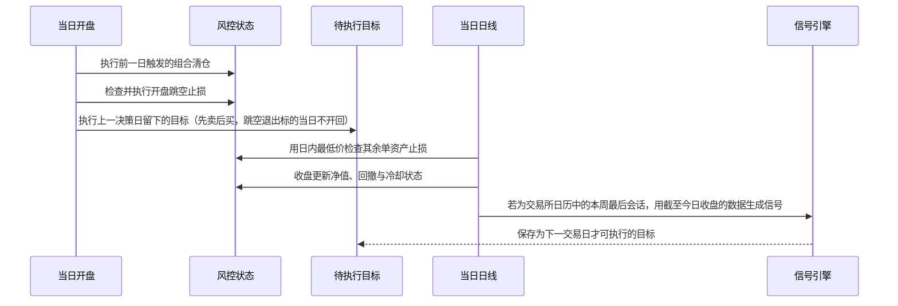

# 策略完整说明

本文按当前代码逐层解释信号、调仓、仓位、风控和执行时序。所有默认值来自
[`configs/strategy.yaml`](../configs/strategy.yaml)，核心实现位于
[`src/etf_rotation/strategy.py`](../src/etf_rotation/strategy.py)。若文档与代码发生偏差，以测试通过的代码和本地配置为准。

> [!IMPORTANT]
> “T+0 ETF 策略”表示标的池只接受配置中明确标记为可日内回转的 ETF，不表示本策略会高频日内交易。当前版本使用已完成的日线，在每周决策日更新目标；T+0 资格主要用于扩大跨市场资产选择和降低退出限制。最终交易资格仍应以券商与交易所当日规则为准。

## 一分钟理解策略

策略先回答四个问题：

1. **能不能买**：历史、价格、成交额和数据是否合格？价格是否站在中长期趋势之上，短趋势是否向上？
2. **优先买谁**：比较跳过最近 5 日的 20/60/120 日加权动量，再用 40 日年化波动率的 $0.75$ 次幂惩罚高波动资产。
3. **买多少**：最多选择 3 个不同风险组、相关性不过高的 ETF，先做逆波动率配置，再缩放到 10% 目标波动率；剩余预算仅在货币 ETF 趋势与动量为正、且不处于年末分红黑窗时使用最多 30% 的现金代理。
4. **何时更新**：每周最后交易日收盘形成一份新子组合，替换四周前的子组合；常规周是周五，节假日周由交易所日历决定；新目标最早在下一交易日执行。

因此，完整组合是最近四个周度信号的平均，而不是每四周一次性全仓换股。趋势不足时允许持有更多现金，甚至全部现金。


## 调仓周期到底是多少

默认配置为 `rebalance_schedule: staggered_weeks`、`rebalance_sleeves: 4`、`rebalance_weekday: 4`。Python 中星期一为 0，所以 `4` 表示星期五。

| 层级 | 默认周期 | 实际含义 |
|---|---|---|
| 信号计算 | 每周最后交易日收盘后 | 生成一份全新的候选组合 |
| 单个子组合 | 约四周 | 本周新信号替换四周前信号 |
| 完整组合 | 每周滚动更新 | 每次通常只更换约四分之一的信号来源 |
| 回测执行 | 下一交易日开盘 | 周度信号不会用决策日收盘价成交 |
| 非调仓日 | 不做例行轮动 | 仅回测中的止损或组合熔断可能触发退出 |

下面是稳定运行后的概念示例：

| 决策周 | 组合中保留的四份信号 | 本周变化 |
|---|---|---|
| 第 4 周 | W1 + W2 + W3 + W4 | 四个子组合完成初始化 |
| 第 5 周 | W2 + W3 + W4 + W5 | W1 到期，加入 W5 |
| 第 6 周 | W3 + W4 + W5 + W6 | W2 到期，加入 W6 |

每份信号在最终组合中只占四分之一。例如 W5 的某 ETF 目标权重为 40%，它对完整组合贡献 10%。四份信号可能选择同一个 ETF，贡献会相加。策略刚启动、历史决策周不足四个时，未初始化的子组合保持现金。

节假日周使用 `exchange-calendars` 的 `XSHG` 交易所日历选取该周最后交易日。例如周四、周五均休市时，周三收盘即可形成信号，下一交易日才执行。调度器还会将 QMT 行情日期与交易所日历逐日比较；缺失本应存在的会话、出现异常会话或日历版本不覆盖请求日期时均拒绝回测/出信号，防止把行情故障当成休市。

## 第一层：标的池与数据资格

默认池包含跨境股票、黄金、国债与货币 ETF。每个品种配置了：

- `role`：`growth`（股票风险资产）、`defensive`（黄金、国债）或 `cash`（只承接闲置预算的货币 ETF）；
- `group`：底层风险组，例如美股、港股、黄金或国债；
- `t0`：必须明确为 `true`，否则配置加载直接失败。

一个品种先要满足以下基础资格：

- 至少 180 根可用日线；
- 最新收盘价不低于 0.50 元；
- 最近 20 日平均成交额不低于 2,000 万元；
- 能计算 20 日 ATR 和 40 日年化波动率；
- 配置中明确标记为 T+0。

资格过滤只解决“数据是否足够、是否可能成交”，不代表已经满足买入趋势。

QMT 的前复权序列可能仍遗漏 ETF 份额拆分。加载器只对接近整数倍、且价格与份额单位反向变化的明显事件做连续化调整；成交额保持不变。当前数据中识别到 513100.SH 的约 5:1 和 513500.SH 的约 2:1 事件，避免把份额拆分误判为暴跌。

## 第二层：绝对趋势过滤

股票型 ETF 必须同时满足：

$$
P_{t,i} > SMA_{180,i}
$$

黄金和国债 ETF 使用较短的防守资产趋势窗口：

$$
P_{t,i} > SMA_{100,i}
$$

所有资产还必须满足 50 日指数移动平均线在过去 20 日上升：

```math
\frac{EMA_{50,t,i}}{EMA_{50,t-20,i}} - 1 > 0
```

长期均线用于过滤主要下降趋势，EMA 斜率用于避免刚刚跌破短趋势的资产。两者都不满足时，资产不会因为“比其他资产跌得少”而被强制选中。

## 第三层：跳过短期脉冲的多周期动量

对决策日 $t$，先把最近 5 个交易日排除，再计算收益：

```math
R_{n,i}^{(-5)} = \frac{P_{t-5,i}}{P_{t-5-n,i}} - 1
```

然后组合 20、60 和 120 日动量：

$$
M_i = 0.20R_{20,i}^{(-5)} + 0.30R_{60,i}^{(-5)} + 0.50R_{120,i}^{(-5)}
$$

120 日信号权重最高，意在捕捉持续趋势；跳过最近 5 日是为了减少追逐单周急涨。$M_i$ 必须大于 0，否则不参与排名。

## 第四层：风险调整后的横截面排名

40 日年化波动率为：

```math
\sigma_{40,i} = \operatorname{SD}(r_{t-39:t,i}) \sqrt{252}
```

最终排名分数为：

```math
Score_i = \frac{M_i}{\max(\sigma_{40,i}, 0.10)^{0.75}}
```

10% 波动率地板防止极低的短期波动把分数异常放大。$0.75$ 次幂保留风险惩罚，但避免排名和逆波动率仓位两次完整惩罚高波动资产。该分数只用于候选排序，不直接等于目标仓位，也不代表预期收益。

### `risk_on` / `risk_off` 的真实作用

代码会用股票型 ETF 中“长期趋势和 EMA 斜率同时为正”的比例，以及股票动量中位数，计算一个市场状态标签：

- 上涨广度至少 40%，且股票动量中位数大于 0：`risk_on`；
- 否则：`risk_off`。

默认 `allocation_mode: unified` 下，股票、黄金和国债仍在同一个候选池竞争，状态标签主要用于诊断和报告，并不会在 `risk_off` 时强制只买防守资产。若把配置改成旧的分状态模式，`risk_on` 才只选股票、`risk_off` 才只选防守资产。

## 第五层：去除重复风险暴露

合格候选按 `Score` 从高到低排列，成交额只在分数相同时用于打破平局。依次选择时执行：

1. 最多选择 3 只；
2. 同一 `group` 最多一只，例如纳指 ETF 与标普 500 ETF 不会同时进入同一周的子组合；
3. 与已选 ETF 最近 60 日相关系数高于 0.85 时跳过。

相关性判断使用原始相关系数而不是绝对值，因此高度负相关的资产允许同时入选。这些规则约束的是每周新生成的单份信号；四份历史信号聚合后，完整组合可能同时出现同组的不同 ETF。

## 第六层：从入选资产到目标权重

### 1. 逆波动率初始权重

对入选资产按 40 日波动率的倒数分配：

```math
\widetilde{w}_i = \frac{1 / \sigma_{40,i}}{\sum_j 1 / \sigma_{40,j}}
```

波动较低的资产获得更高权重，但股票、黄金和国债的单资产上限均默认为 40%。权重触及上限后不会把被截掉的部分强制分给其他资产，差额保留为现金。

### 2. 组合波动率缩放

使用最近 60 日收益协方差估算组合年化波动率：

```math
\sigma_p = \sqrt{252 \, w^{\mathsf T} \Sigma w}
```

若估算值高于 10%，所有风险资产权重同比例缩小：

```math
k = \min\left(1, \frac{0.10}{\sigma_p}\right), \qquad w_i = k\widetilde{w}_i
```

策略不加杠杆，所以估算波动低于 10% 时不会反向放大仓位。最后还应用 90% 总仓位上限，因此理论现金比例至少为 10%，趋势不足或波动偏高时现金会更多。

### 3. 闲置风险预算的货币 ETF 现金代理

初始权重和波动率缩放后若仍有闲置预算，策略可用 `511880.SH` 补充至最多 30%。它的 `role: cash` 使其永远不参加主资产横截面排名；只有长期趋势向上、加权动量为正、数据合格且不处于分红黑窗时才能承接余额。它不要求短期 EMA 斜率为正，以减少低波动资产的短周期噪声。加入后仍检查组合波动率、单资产 40% 与总仓位 90% 上限。

银华日利的价格在年末收益分配后回到约 100 元。生产实现把原始 OHLC 与因果连续信号分开：原始价格始终用于成交、估值、ATR 和止损；只用截至当日已观察到的价格复位重建 `signal_close`，用于趋势、动量、波动率与相关性。回测不把估算分配记为现金收益。

由于 QMT 当前没有可可靠幂等对账的策略级分红流水，策略在每年 12 月 15 日至次年 1 月 15 日（含首尾）强制空仓。回测按首个可用开盘卖出；`live-once` 和 `live-monitor` 都会锁存退出，直到成交对账证明持仓消失。只有 12 月 27 日至 31 日允许识别价格复位；其他日期出现超过 0.5% 的异常下跌，或复位后价格偏离 100 元超过 0.50 元，都会拒绝回测、信号和实盘计划。

### 4. 四份目标聚合

最终目标是最近四份周信号逐项相加再除以 4：

```math
w_{i,t}^{\mathrm{final}} = \frac{1}{4} \sum_{s=0}^{3} w_{i,t-s}^{\mathrm{sleeve}}
```

这里的 $t-s$ 表示最近四个有效周度决策日，而不是最近四个自然日。

## 第七层：订单如何形成

### 可选 LLM 风险复核

启用 `llm.enabled` 后，最近四份量化子组合聚合完成，再将决策日、市场状态、目标权重和各 ETF 的趋势/动量/波动率/分数交给 LiteLLM。单模型直接形成一票；多模型并行调用后按有效票严格多数聚合。模型只可返回 `KEEP`、`REDUCE`、`EXIT` 以及 $[0,1]$ 内的组合/单标的缩放比例。最终权重满足：

```math
w_i^{LLM} = w_i^{quant} \times s_p \times s_i, \qquad 0 \le s_p,s_i \le 1
```

因此 LLM 永远不能新增量化目标之外的 ETF，也不能放大任一权重。低置信度动作降级为 `KEEP`；合法票不足、调用失败或无明确多数时按 `failure_policy` 回退。默认 `quant_only` 保持量化目标，`all_cash` 清空风险权重，`error` 阻止计划继续。周度缓存把输入摘要、配置指纹、投票、原始响应和最终结果绑定到确定性 ID，重复运行默认不重新采样。

LLM 层只接入 `signal`/`live-once`，不接入历史回测器；当前 README 的历史指标代表纯量化基线。要评价 LLM 增量价值，必须封存每周真实模型响应做向前模拟，不能用今天的模型回填过去。

目标金额先用策略资金上限乘以目标权重，再按最新可用价格换算数量，并向下取整到 100 份整手。目标与当前仓位之差形成订单：

- 先卖后买，降低现金不足风险；
- 默认 1% 资金权重变化容忍带，避免为现有持仓的很小权重漂移支付成本；完整退出和新建仓不受该容忍带限制；
- QMT 计划只允许卖出“策略持仓账本、账户真实持仓、账户可用数量”的交集；
- 同代码存在不属于策略账本的人工持仓时，计划会拒绝继续，防止误卖；
- 报价缺失或超过 5 秒时拒绝为相关目标生成可靠执行。

`--capital` 是该策略可使用的资金上限，不是“本次买入金额”，也不会默认取整个账户资产。

## 第八层：回测中的风险控制

### 单资产止损

首次建仓时记录成交价 $E$ 和当时的 $ATR_{20}$。初始止损为：

```math
Stop_{\mathrm{initial}} = E - \max(2.5 \times ATR_{20}, 0.015E)
```

当持仓最高价相对入场价至少上涨 $1.5 \times ATR_{20}$ 后，启用跟踪候选：

```math
Stop_{\mathrm{trailing}} = HighWatermark - \max(3.0 \times ATR_{20}, 0.015E)
```

实际止损价取初始止损和跟踪候选中较高者。1.5% 最小距离主要防止国债等低波资产因极小 ATR 被日常噪声反复洗出；ATR 固定为入场时数值，不随持仓期间重新计算。若开盘已经低于止损价，回测先于例行调仓按更差的开盘价退出，并禁止同一开盘立即买回；否则日内最低价触及止损时按止损价退出。

### 组合风险

| 条件 | 回测动作 | 冷却 |
|---|---|---:|
| 从净值峰值回撤达到 8% | 下一次例行再平衡时把目标风险仓位缩放到 50% | 无 |
| 从净值峰值回撤达到 12% | 标记为下一交易日开盘清仓 | 10 个交易日 |
| 单日净值亏损达到 2% | 标记为下一交易日开盘清仓 | 5 个交易日 |

硬回撤触发后以当时权益开始新的风险周期，避免旧高点导致冷却结束后立即反复熔断。冷却期间不接受新的风险目标。

> [!WARNING]
> 实时账本会持久化持仓成本、入场 ATR、最高价、净值峰值、冷却期和成交去重信息。`live-monitor` 可在连续交易时段轮询并提交保护性卖单，但它是前台进程，不是券商端止损或 Windows 后台服务；窗口关闭、休眠、QMT/网络断开都会中止保护。部分成交、撤单和故障恢复仍须在模拟盘验证，不能仅凭回测将其视为无人值守能力。

### 实盘入口如何对应这些风控

- `live-once` / `scripts/live.ps1`：刷新已完成日线、生成周度目标、对账账本，先用实时价格评估并锁存风险退出，再生成或提交一次再平衡批次；触发退出的标的不会被同一周度目标重新打开；
- `live-monitor` / `scripts/live-monitor.ps1`：在连续交易时段轮询策略持仓，更新最高价和组合权益，触发 ATR、硬回撤或单日亏损卖出；
- `reconcile` / `scripts/reconcile.ps1`：读取带本策略标签的新成交，按成交 ID 幂等更新数量、成本和现金。

`live-monitor` 的 dry-run 模式只打印会触发的退出，不提交委托；`-Execute` 还必须同时通过配置开关和人工确认。风险退出按交易日和订单内容生成稳定计划 ID，已经处理的计划不会盲目重复提交。账户实际持仓与策略账本不一致、实时价格缺失或代码已有在途单时，监控会停止并要求人工核查。

## 一天内的计算与执行顺序

回测器的日内顺序如下，这个顺序决定了是否存在未来函数：



特别是，决策日收盘后才知道的信号绝不会按同一个决策日的收盘价成交。

## 如何读 `signal` 输出

运行 `etf-rr signal` 后，关键字段含义如下：

| 字段 | 含义 |
|---|---|
| `decision_date` | 最近一份有效周度信号的决策日 |
| `regime` | 最近四份信号汇总后的诊断标签 |
| `weights` | 四份子组合聚合后的最终目标权重 |
| `selected.*.momentum` | 最近决策日该 ETF 的加权动量 |
| `selected.*.volatility` | 40 日年化波动率 |
| `selected.*.score` | 动量除以波动率地板 $0.75$ 次幂后的排序分数 |
| `selected.*.atr` | 最近决策日的 ATR(20) |
| `diagnostics.sleeves_initialized` | 已经参与聚合的周信号数量，最多 4 |
| `diagnostics.gross_exposure` | 聚合后的目标风险资产总仓位 |

`selected` 只携带最新决策日、且仍出现在聚合权重中的信号详情；某个持仓若仅来自更早子组合，其详细信号不一定能在该映射中完整解释。因此审计时还应保留每周目标记录。

## 默认参数速查

| 模块 | 参数 | 默认值 |
|---|---|---:|
| 调仓 | 子组合数 | 4 |
| 调仓 | 决策日 | 每周最后交易日（常规周为周五） |
| 动量 | 周期 / 权重 | 20/60/120 日；20%/30%/50% |
| 动量 | 跳过窗口 | 5 日 |
| 趋势 | 股票 / 防守 SMA | 180 / 100 日 |
| 趋势 | EMA / 斜率窗口 | 50 / 20 日 |
| 排名 | 波动率窗口 / 地板 / 指数 | 40 日 / 10% / 0.75 |
| 去重 | 相关性窗口 / 上限 | 60 日 / 0.85 |
| 选股 | 单份信号最多持有 | 3 只 |
| 仓位 | 目标波动率 | 10% |
| 仓位 | 单资产 / 总仓位上限 | 40% / 90% |
| 仓位 | 货币 ETF 现金代理上限 | 30%（长期趋势与动量为正，黑窗外） |
| 企业行动 | 货币 ETF 强制空仓 / 允许复位识别 | 12-15 至 01-15 / 12-27 至 12-31 |
| 交易 | 最小权重变化 | 1% |
| 止损 | 初始 / 激活 / 跟踪 ATR 倍数 / 最小距离 | 2.5 / 1.5 / 3.0 / 1.5% |
| 熔断 | 软回撤 / 硬回撤 / 单日亏损 | 8% / 12% / 2% |

## 策略会在哪些情况下持有现金

- 所有 ETF 都不满足绝对趋势或正动量；
- 只有一两只合格资产，单资产 40% 上限留下余额；
- 组合估算波动率高于 10%，触发同比缩仓；
- 总风险仓位达到 90% 上限；
- 策略刚启动，四个子组合尚未全部初始化；
- 回测组合处于风险冷却期。
- 处于货币 ETF 年末强制空仓黑窗。

持有现金是策略设计的一部分，不是选股失败。

## 当前策略明确不做什么

- 不预测下一日涨跌，也不使用机器学习黑箱；
- 不使用杠杆、融资或卖空；
- 不因为标的是 T+0 就在日内反复买卖；
- 不在所有资产趋势为负时强制满仓；
- 不保证 10% 实现波动率，更不保证固定收益率；
- 不处理实时 IOPV、ETF 折溢价、申赎额度或海外休市错位；
- 不把历史回测通过当成可直接无人值守实盘的证明。

## 修改参数前的验证清单

1. 先记录修改假设，不要只因为某个历史区间收益更高而改参数。
2. 同时运行基础成本和双倍成本回测。
3. 检查开发、验证、近期区间，而不只看全样本 CAGR。
4. 检查相邻参数是否稳定，避免某个精确数值形成收益断崖。
5. 冻结参数后至少做 20 个交易日向前模拟盘。
6. 实盘前核对 T+0 资格、最小佣金、滑点、折溢价和成交状态恢复。

完整的研究门槛与已知样本局限见 [`VALIDATION.md`](VALIDATION.md)，账号、路径和密钥的处理规范见 [`SECURITY.md`](SECURITY.md)。
